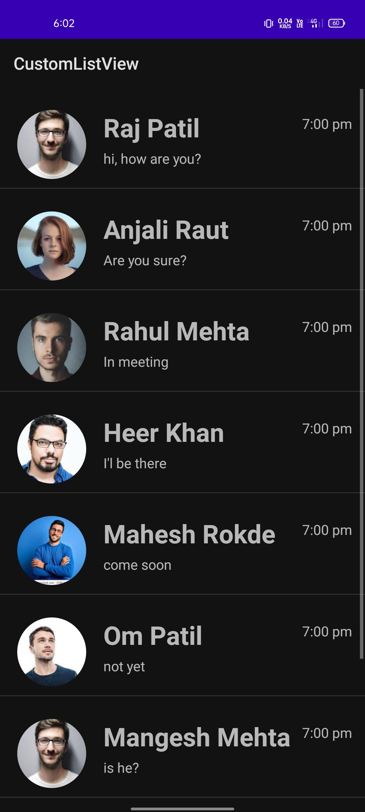
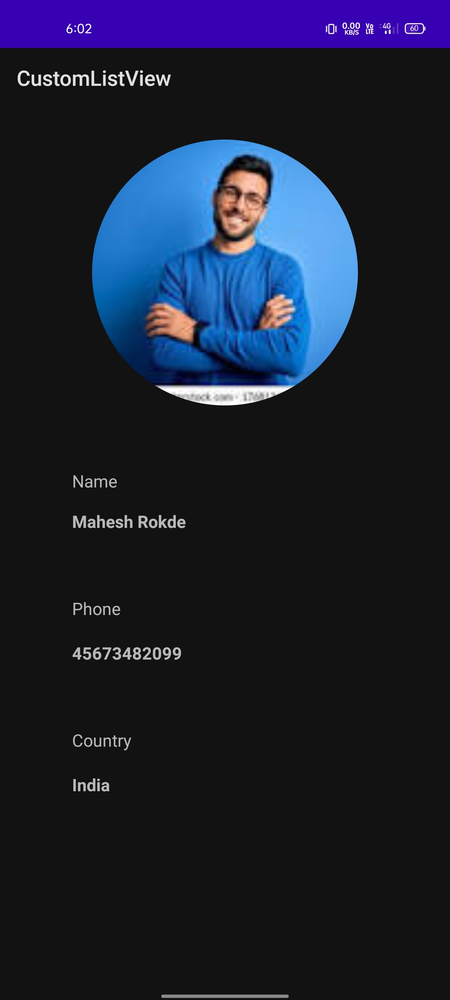

# List View Profile App

The List View Profile App is an Android application that utilizes a custom ListView to display a list of contacts. Each item in the list contains the contact's name, profile picture, last message, and the time of the last message.

## Features

- Custom ListView implementation for efficient and customizable contact list display.
- Clicking on an item opens the contact's profile page, displaying their larger profile picture, name, mobile number, and country.

## Screenshots

### Contact List

### Contact Profile

## Usage

To run the List View Profile App on your Android device or emulator:

1. Clone this repository to your local machine.

2. Open the project in Android Studio.

3. Build and run the app on your device or emulator.

4. Explore the contact list and click on an item to view the corresponding contact's profile.

## Technologies Used

- Kotlin programming language
- Android SDK
- ListView and custom adapters for list display
- Intents for opening the contact profile activity

